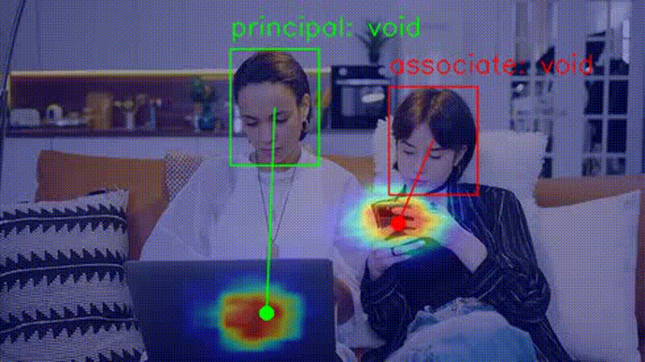

# CoSI-Gaze: Context-Spatial Integration for Gaze Target Detection and Social Gaze Prediction

Official implementation of **CoSI-Gaze** [[paper](https://www.sciencedirect.com/science/article/pii/S0031320326015165)], a framework for gaze target detection and social gaze prediction that integrates contextual information with spatial gaze relationships.



## Data and Model Resources

The **DyGaze** dataset is available here:

- DyGaze dataset: [[Google Drive](https://drive.google.com/drive/folders/1Paa_tFUdrVlwm55Gaxe70KCBw6wM1y5E?usp=sharing)]

Pretrained model checkpoints are available here:

- CoSI-Gaze: 
  - main model [[Google Drive](https://drive.google.com/file/d/1XHWZIzVTWHnv3iUvX101-SdghbR7f7J4/view?usp=sharing)] 
  - finetuned on GP-Static [[Google Drive](https://drive.google.com/file/d/1a3MtwGpYmQFOIlt1q7U-BfeLzqdSt7h-/view?usp=sharing)] 
  - finetuned on LAEO [[Google Drive](https://drive.google.com/file/d/1CcqDu5Znk0UWyY6w5AkTQp5hG1CRkUIq/view?usp=sharing)] 
  - finetuned on CoAtt [[Google Drive](https://drive.google.com/file/d/1PTo63sORQzFQsrda1TsuEjFqq5myDusi/view?usp=sharing)] 
- Head-detector: [[Google Drive](https://drive.google.com/file/d/1o2vAb11XVoISIpD8VFubEv6RgOdSdLIs/view?usp=sharing)]

Before training or evaluation, update the machine-specific paths in:

- `config/config.yaml` — output directory, device, and general settings
- `config/data/data.yaml` — dataset locations
- `config/model/cosi.yaml` — DINOv2 backbone location and model settings


## Training

> Note: Before running any training, evaluation, or prediction commands, first enter the `/src` directory. All commands in this README are expected to be executed from inside the `/src` directory.

Fine-tuning is launched with `train.py`. Select a stage configuration and an integration strategy:

```bash
python train.py \
  --stage finetune_dyadic_pattern \
  --integration confidence_coordinated \
  --pretrained /path/to/pretrained_checkpoint.pth
```

Supported fine-tuning stages are:

- `finetune_gazefollow`
- `finetune_dyadic_gf`
- `finetune_dyadic_pattern`
- `finetune_gp_static`
- `finetune_coatt`
- `finetune_laeo`

Supported integration strategies are:

- `context`
- `spatial`
- `confidence_coordinated`
- `confidence_gate`
- `confidence_weighted`
- `concated`

Use `--freeze-spatial` to freeze the spatial-relator parameters. Run `python train.py --help` for the complete command-line interface.

## Evaluation

Evaluate a trained CoSI-Gaze checkpoint with `eval.py`:

```bash
python eval.py \
  --stage eval_dyadic \
  --integration confidence_coordinated \
  --pretrained /path/to/checkpoint.pth
```

Supported evaluation stages are:

- `eval_dyadic`
- `eval_gp_static`
- `eval_coatt`
- `eval_laeo`

Metrics are written under the configured `save_dir` by default. Use `--output-dir` to select another destination and `--pred-save-file predictions.csv` to save per-sample predictions.

Run `python eval.py --help` for all evaluation options.

## Prediction and Visualization

`predict_visualize.py` supports image and video input for both single-person gaze-target prediction and two-person social-gaze prediction.

Single-person video inference:

```bash
python predict_visualize.py \
  --mode one \
  --source video \
  --input /path/to/video.mp4 \
  --pretrained /path/to/checkpoint.pth
```

Two-person video inference:

```bash
python predict_visualize.py \
  --mode two \
  --source video \
  --input /path/to/video.mp4 \
  --pretrained /path/to/checkpoint.pth
```

The script uses the head detector configured by `--head-detector` and saves rendered videos plus JSON predictions. It also supports `--source image`; for single-person images, a manual head box can be supplied with `--head-box X1 Y1 X2 Y2`.

Run `python predict_visualize.py --help` for all inference options.

## Project Structure

```text
src/
├── config/               Hydra model, data, and stage configurations
├── data/                 Dataset readers and dataloader construction
├── engine/               Training and evaluation loops
├── inference/            Preprocessing, prediction, and visualization
├── models/               CoSI-Gaze model and components
├── train.py              Fine-tuning entry point
├── eval.py               Evaluation entry point
└── predict_visualize.py  Image/video inference entry point
```


## Acknowledgements

CoSI-Gaze builds on the following projects and resources:


- [DINOv2](https://github.com/facebookresearch/dinov2) for the visual backbone used by CoSI-Gaze.
- [Ultralytics](https://github.com/ultralytics/ultralytics) for head detection in the prediction and visualization pipeline.
- [VideoAttentionTarget](https://github.com/ejcgt/attention-target-detection) for pretraining on gaze-following data.
- [GP-Static](https://github.com/fei-chang/Gaze-Pattern-Recognition-in-Dyadic-Communication) dataset for dyadic social gaze prediction
- [UCO-LAEO](https://www.uco.es/investiga/grupos/ava/portfolio/uco-laeo/) dataset for mutual social gaze prediction.
- [CoAtt](https://github.com/LifengFan/Shared-Attention) dataset for shared social gaze prediction.

We sincerely appreciate the authors and maintainers of these projects. 

## Related Projects

Following are open-source projects discussed in our paper. They provide valuable contributions to gaze following and social gaze prediction:

- MTGS: A Novel Framework for Multi-Person Temporal Gaze Following and Social Gaze Prediction [[paper](https://openreview.net/forum?id=ALU676zGFE)]
[[project](https://github.com/idiap/MTGS)]
- Sharingan: A Transformer Architecture for Multi-Person Gaze Following [[paper](https://openaccess.thecvf.com/content/CVPR2024/papers/Tafasca_Sharingan_A_Transformer_Architecture_for_Multi-Person_Gaze_Following_CVPR_2024_paper.pdf)]
[[project](https://github.com/idiap/sharingan)]
- ViTGaze: Gaze Following with Interaction Features in Vision Transformers [[paper](https://link.springer.com/article/10.1007/s44267-024-00064-9)] [[project](https://github.com/hustvl/ViTGaze)]

We encourage readers to explore these repositories. We thank the authors' contributions to the field.

## SeetaPsych
CoSI-Gaze has been integrated in [SeetaPsych](https://github.com/seetapsych), an open-source ecosystem for computational analysis of human behavioral and psychological signals. In particular, [SeetaPsych Gaze Follow](https://github.com/seetapsych/seetapsych-gaze-follow) integrates CoSI-Gaze for gaze following and social gaze prediction.

We encourage readers interested in related applications and tools to explore the broader [SeetaPsych](https://github.com/seetapsych) ecosystem.

## Citation

If you find this work useful, please consider citing:

```bibtex
@article{chang2026cosi,
  title     = {CoSI-Gaze: Context-Spatial Integration for Gaze Target Detection and Social Gaze Prediction},
  author    = {Chang, Fei and Zeng, Jiabei and Jiang, Dongmei and Shan, Shiguang},
  journal   = {Pattern Recognition},
  pages     = {114552},
  year      = {2026},
  publisher = {Elsevier}
}
```
